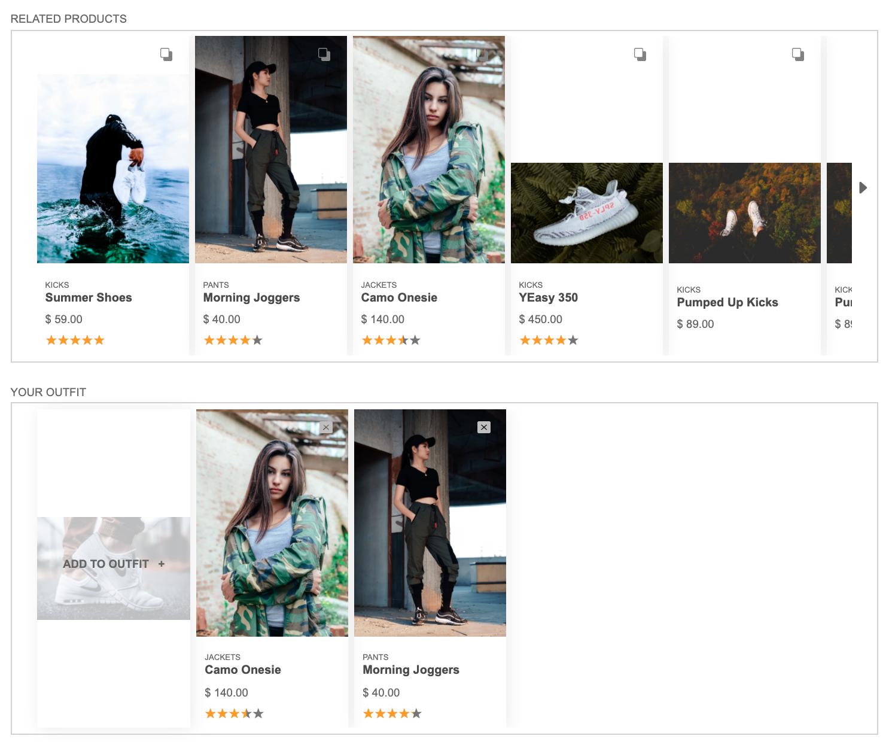
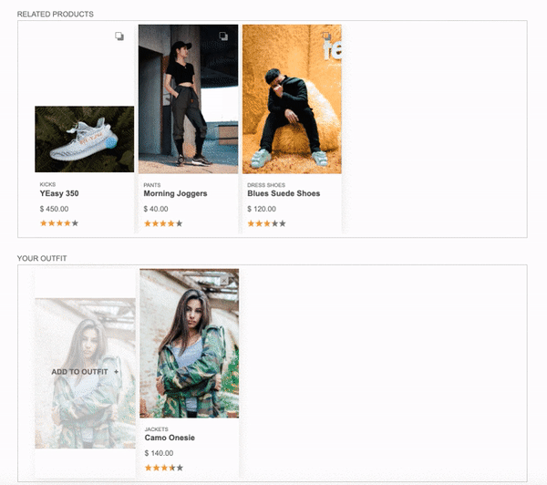
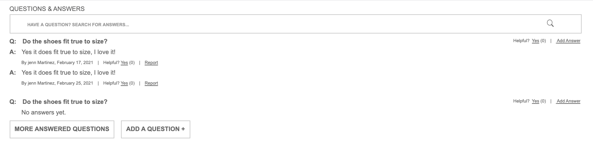
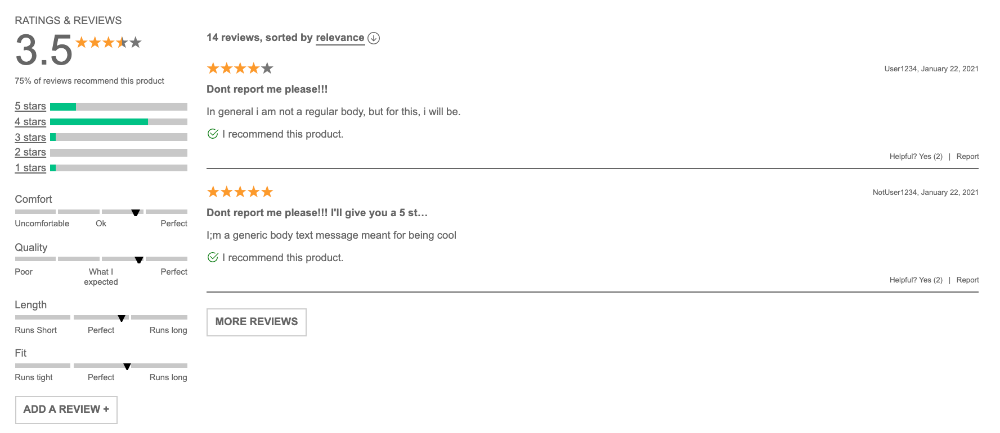

# Front End Capstone
> Table of Contents

- [Introduction](#Introduction)
- [Technologies](#Technologies)
- [Components guide](#Components)
- [Installation Guidelines](#Installation-Guidelines)
- [Resource](#Resource)

## Introduction
> Developed by Aharon Kolatch, Cody Jue, Will Chang and Claire Sujin Kim
```
We developed this project as a group over the course of 9 days during the Hack Reactor program.
We were all worked on our own individual widget for the site.

built up based on given a business document outlined a strict set of requirements that guided
our implementation, functionality, and styling.
```
- **Aharon** - Product Overview
- **Claire** - Related Items and Comparison
- **Cody** - Questions and Answers
- **Will** - Ratings and Reviews


## Technologies
For this project, we used the following languages and frameworks in our implementation
```bash
- Javascript
- React
- Redux
```
> Deployment
We deployed our site on AWS, which can be viewed **here**

## Components

#### 1. Product Overview
This feature gives client the ability to filter through all styles available for a product. Client can click through a gallery of images for a given style. Client can add products by quantity and size. This was the top-most module on the Product Detail page. The functionality contained within this module can be divided into several pieces:
* Image gallery
* Product information
* Style selector
* Add to cart


#### 2. Related Items and Comparison
The Related Products module was implemented to provide clients with a carousel of related products from the Product Overview. The carousel allows clients to navigate to related products and compare the given characteristics of each product.
The Your Outfit List module below the Related Products carousel allows clients to select a current item and add it to their own list to group together as an outfit.
* Carousel with related Product Cards
* Navigating to the related products
* Comparison Modal
* Carousel to add to Outfit



#### 3. Questions & Answers
The Questions & Answers module was implemented to allow asking and answering of questions for a product selected. The functionality contained within this module can be divided into several pieces:
* View questions
* Search for a question
* Asking a question
* Answering a question


#### 4. Ratings and Reviews
The Ratings & Reviews module was implemented to allow viewing and submission of reviews for a product selected. The functionality contained within this module can be divided into several pieces:
* Write new review
* Reviews List
* Sorting
* Rating,Product Breakdown


## Installation Guidelines
  1. clone this repo to your local machine
  2. run ```npm install``` in the 'root' directory
  3. run ```npm run build-dev```
  4. run ```npm start```
  5. find the site on ***localhost:3333***

## Resource
- **esLint** : https://eslint.org/docs/user-guide/command-line-interface
- **Enzyme** : https://www.npmjs.com/package/enzyme


_Have a great day!_
