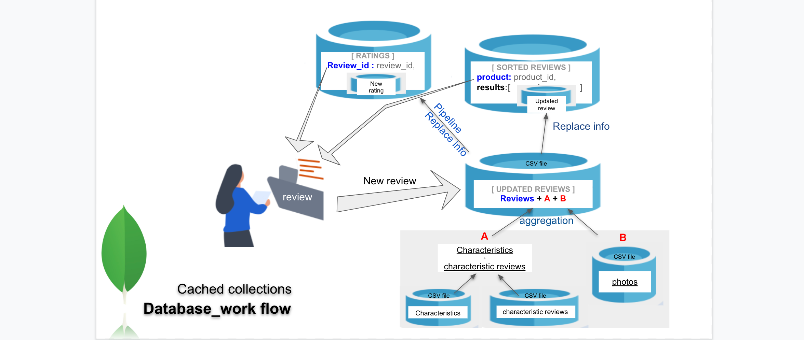
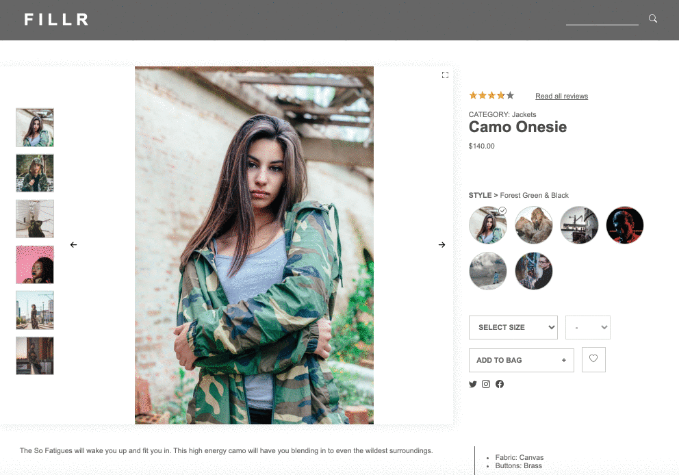

# System Design Capstone
```
[ Introduction ]
Over the course of 12 days during our time at Hack Reactor, cohort 34, Team tres-leches composed 
of the astounding team of 3 developers, Claire Sujin Kim, Raymond Hunce, Tina Tkatchenko, 
was tasked to create a working backend of each of their respective parts to an API of an E-commerce site. 

Each of us was assigned to one piece of the API:

1. Products - Tina
2. Q & A - Raymond  
3. Reviews - Claire
```
> found in our team repository : [tres Leches](https://github.com/hrnyc34-SDC-tresLeches)

# Reviews API

> Table of Contents

- [Engineer](#Engineer)
- [Overview](#overview)
- [Technologies](#Technologies)
- [Installation guide](#installation)
  
  
## Engineer 
  ### Claire Sujin Kim

Instead of performing that aggregation on every page hit, I put the aggregated list into a new collection. You can query the cached results in that collection directly getting info by product id or review id in new cached collections will be far faster than performing that aggregation all the time.



  Front-end build can be found in its [repository](https://github.com/hrnyc34-FEC-Financier/fec/tree/claire-dev)

## Overview 
Building up a server and database to support retail website, integrated a legacy codebase you’ve never seen before with the existing front-end, and Focusing on the Back End side of optimizing your system
• Utilized Javascript, Node, Express, MongoDB, Mongoose, npm.
• Established ETL process to transform legacy data with over 30 million entries into usable RESTful API routes.
• Optimized mongoose queries utilizing indexing, and aggregation.
• Adopted MongoDB functionality to denormalize the data and minimize the aggregation to query faster.
• Designed a caching database to speed up a 15 second query to a ~50ms query.

  _The functionality of the review API is outlined [here](https://gist.github.com/trentgoing/d69849d6c16b82d279ffc4ecd127f49f#file-reviews-md)._ 



## Technologies
For this project, I used the following languages and frameworks in our implementation:
- Node.js
- Express
- MongoDB
- Mongoose ODM
- Docker

## Installation
  1. clone this repo to your local machine
  2. run ```npm install``` in the 'root' directory
  2. run ```npm run build-prod```
  3. run ```npm run build-dev```
  4. run ```npm start```
  5. find the site on ***localhost:3333***
